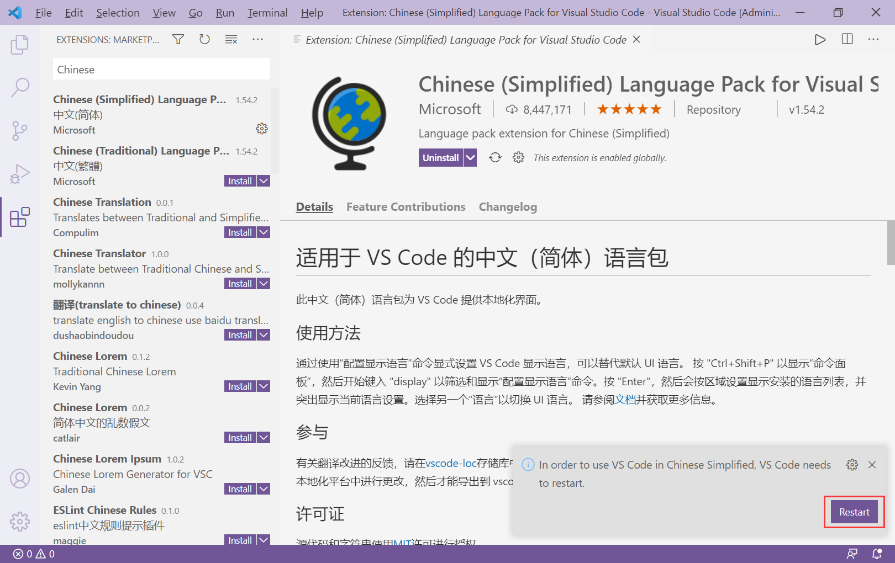
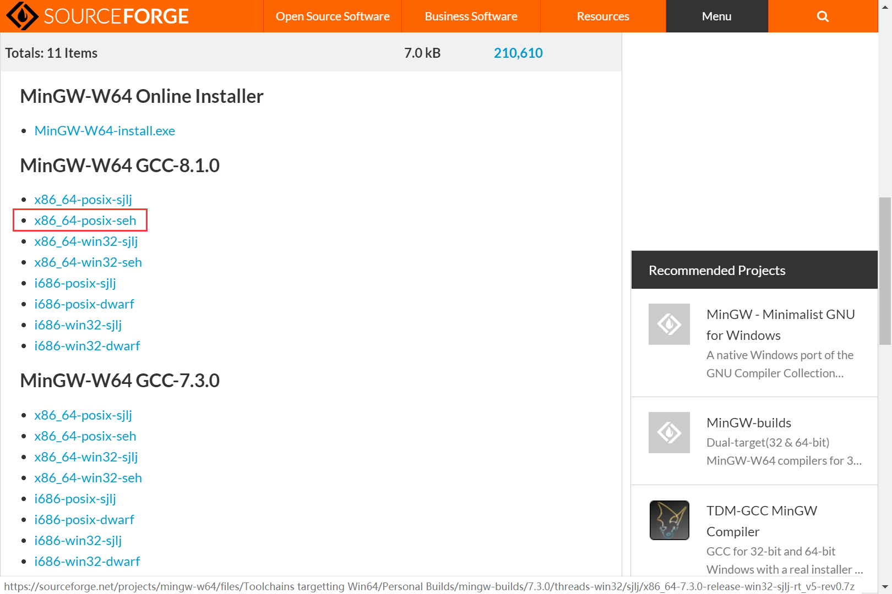

# 从零开始配置 Visual Studio Code 一键调试运行 C/C++ 程序

## 前言

Visual Studio Code（以下简称 VS code）是一款跨平台的轻量级**文本编辑器(editor)**。尽管不是用于专门编写 C/C++ 程序，但它以便捷美观、插件丰富等等优势获得了不少人的青睐。由于 VS code 并非 **IDE(集成开发环境)**，不包含**编译器(compiler)**等功能，因此我们需要自动手动安装编译器和相关功能，以便一键调试运行 C/C++程序。

本文来自于我个人配置 VS code 调试运行 C/C++ 程序的经验，恳请诸位读者提出修改意见。

由于时间问题，目前本文仅有主要框架内容，后续会持续更新。

## 步骤

### 一、VS code 基本配置

#### 1. 下载

前往 [VS code 官网](https://code.visualstudio.com/) 选择 Download for Windows 进行下载，在电脑上安装 VS code 。


安装时可能出现如下提示，按”确定“即可。
<div style="text-align: center"></div>

出现这个提示的原因是，VS code 有两个版本：一个是 User 版，也就是打开我们下载的版本；另一个是 System 版，需要到官网的下载页面下载。两者的区别在于前者会将 VS code 的默认安装路径和配置会在当前帐户的路径，如果另外一个帐户在这台电脑上登录，将无法使用 VS code，后者则反之。

#### 2. 配置中文

打开 VS code，默认语言一般是英文，按以下步骤安装中文语言包插件。

点击左边红框中的图标，进入插件商店。


搜索“Chinese”，点击第一项的“Install(安装)”。


点击“Restart(重启)”，即可切换到中文界面。



此外，第一次打开 VS code 时的默认主题是深色，可以在左上角菜单 “文件”->”首选项“->”颜色主题“ 中自行修改。

### 二、安装编译器

#### 1. 下载 MinGW-w64

前往 [MinGW-w64 的资源网页](https://sourceforge.net/projects/mingw-w64/files/)。


滚动到下图位置，从 GCC 的最新版本中选择对应自己电脑的版本下载。**不要下载 Online Installer，避免安装速度过慢。**



下载得到7z压缩文件，右键菜单点击“解压到当前文件夹”，得到“mingw64”文件夹。


#### 2. 配置 MinGW-w64

将上一步所得文件夹“mingw64”复制到一个不易被删除的地方（如 C:\ ），记下文件夹路径（如 C:\mingw64 ）。


打开“系统属性”：

方法一：Win + R 打开“运行”，输入“sysdm.cpl”回车即可。


方法二：回到桌面，右键点击“此电脑”并选择“属性”菜单项，在弹出的窗口中找到“高级系统设置”即可。


选择“系统属性”的“高级”选项卡，并点击“环境变量”按钮。


在弹出的窗口中的“系统变量”中双击“Path”项。


在“编辑环境变量”窗口中点击“新建”按钮，**输入你“mingw64”文件夹的路径并加上“\bin”**，如下图。


#### 3. 编译器检测

Win + R 打开“运行”，输入“cmd”打开命令行，在命令行里输入“gcc --version”，即查看 GCC 编译器的版本，出现如下画面则表示配置成功；反之，需要回到上一步重新配置。


### 三、调试 C / C++ 程序

#### 1. 配置工作区文件

要在 VS code 中调试 C / C++ 程序，你需要一个**工作区**，而你的代码**需要放到一个文件夹（工作区文件夹**）里，且**你的路径不能有任何中文和引号，同时最好没有空格。**

**在工作区文件夹里新建文件夹“.vscode”，然后在“.vscode”里再新建两个文件： launch.json 和 tasks.json ，输入以下内容并保存：**

```json
// launch.json
{
    "version": "0.2.0",
    "configurations": [{
        "name": "(gdb) Launch",
        "type": "cppdbg",
        "request": "launch", 
        "program": "${fileDirname}/${fileBasenameNoExtension}.exe", 
        "args": [], 
        "stopAtEntry": false, 
        "cwd": "${workspaceFolder}",
        "environment": [], 
        "externalConsole": true, 
        "internalConsoleOptions": "neverOpen", 
        "MIMode": "gdb", 
        "miDebuggerPath": "gdb.exe", 
        "setupCommands": [
            {
                "description": "Enable pretty-printing for gdb",
                "text": "-enable-pretty-printing",
                "ignoreFailures": false
            }
        ],
        "preLaunchTask": "Compile" 
    }]
}
```

``` json
// tasks.json - C语言版
{
    "version": "2.0.0",
    "tasks": [
        {
            "label": "Compile",
            "command": "gcc",
            "args": [
                "${workspaceFolder}//*.c",
                "-o",
                "${fileDirname}/${fileBasenameNoExtension}.exe",
                "-g",
                "-m64",
                "-Wall",
                "-static-libgcc",
                "-fexec-charset=GBK",
                "-D__USE_MINGW_ANSI_STDIO"
            ],
            "type": "process",
            "group": "build",
            "presentation": {
                "echo": true,
                "reveal": "always",
                "focus": false,
                "panel": "shared"
            },
            "problemMatcher": "$gcc"
        },
        {
            "type": "cppbuild",
            "label": "C/C++: g++.exe 生成活动文件",
            "command": "C:\\mingw64\\bin\\g++.exe", // 此处要改成你的“mingw64”文件夹路径
            "args": [
                "-g",
                "${file}",
                "-o",
                "${fileDirname}\\${fileBasenameNoExtension}.exe"
            ],
            "options": {
                "cwd": "${workspaceFolder}"
            },
            "problemMatcher": [
                "$gcc"
            ],
            "group": {
                "kind": "build",
                "isDefault": true
            },
            "detail": "调试器生成的任务。"
        }
    ]
}
```

以上是**调试C语言程序的配置**，如果要**调试 C++ 程序，需要将对 tasks.json 进行如下修改。**

``` json
// tasks.json - C++版
{
    "version": "2.0.0",
    "tasks": [
        {
            "label": "Compile",
            "command": "g++", // gcc 改为 g++
            "args": [
                "${workspaceFolder}//*.cpp", // *.c 改为 *.c
                "-o",
                "${fileDirname}/${fileBasenameNoExtension}.exe",
                "-g",
                "-m64",
                "-Wall",
                "-static-libgcc",
                "-fexec-charset=GBK",
                "-D__USE_MINGW_ANSI_STDIO"
            ],
            "type": "process",
            "group": "build",
            "presentation": {
                "echo": true,
                "reveal": "always",
                "focus": false,
                "panel": "shared"
            },
            "problemMatcher": "$gcc"
        },
        {
            "type": "cppbuild",
            "label": "C/C++: g++.exe 生成活动文件",
            "command": "C:\\mingw64\\bin\\g++.exe", // 此处要改成你的“mingw64”文件夹路径
            "args": [
                "-g",
                "${file}",
                "-o",
                "${fileDirname}\\${fileBasenameNoExtension}.exe"
            ],
            "options": {
                "cwd": "${workspaceFolder}"
            },
            "problemMatcher": [
                "$gcc"
            ],
            "group": {
                "kind": "build",
                "isDefault": true
            },
            "detail": "调试器生成的任务。"
        }
    ]
}
```


#### 2. 打开工作区

方法一：在 VS code 左边的 "资源管理器"(快捷键 Ctrl + Shift + E) 点击 “打开文件夹” 按钮，打开工作区文件夹即可。


方法二：在工作区文件夹空白处右键打开菜单选中“通过 Code 打开”即可。


打开后 VS code 将显示如下画面：


需要注意的是，**以后进行调试都要按照上述步骤打开工作区，单独打开代码文件需要重新配置才能进行调试。**

若要关闭工作区，只需在左上角菜单 “文件” -> "关闭文件夹" 即可。

#### 3.  调试 C / C++ 程序

在工作区文件夹里编写代码，按 Ctrl + Shift + B 即可在当前目录下生成 exe 应用程序，直接按 F5 即可进行调试。

在 tasks.json 的配置中，我们**使其编译了当前目录下的所有 C / C++ 代码，这使多代码文件的 C / C++ 程序也可以进行调试。**然而，这样就会引出我们需要注意的一点——**工作区文件夹下的所有代码中，只能有一个 main() 函数**，否则就会出现如下错误：


### 四、运行 C / C++ 程序

#### 1. 安装并配置 Code Runner

打开 VS code ，类似第一步的操作，在插件商店搜索“Code Runner”并安装。


打开左上角菜单 “文件”->"首选项"->“设置”(快捷键 Ctrl + , )，点击下图右上角红框中的图标，打开 setting.json。


在 setting.json 的 “{”、“}” 符号（即左右花弧号）之间中输入以下内容，保存即可：

```json
    "code-runner.runInTerminal": true, // 在终端中输出，避免中文乱码
    "code-runner.executorMap": { // Code Runner 运行时的命令
        "c": "gcc '*.c' -o '$fileNameWithoutExt.exe' -Wall -O2 -m64 -lm -static-libgcc -fexec-charset=GBK -D__USE_MINGW_ANSI_STDIO && &'./$fileNameWithoutExt.exe'", // C文件
        "cpp": "g++ '*.cpp' -o '$fileNameWithoutExt.exe' -Wall -O2 -m64 -static-libgcc -fexec-charset=GBK && &'./$fileNameWithoutExt.exe'"
    }, // C++ 文件
    "code-runner.saveFileBeforeRun": true, // 运行前自动保存文件
    "code-runner.preserveFocus": false,     // 运行时鼠标焦点移动到终端上
    "code-runner.fileDirectoryAsCwd": true,
    "code-runner.saveAllFilesBeforeRun": true,
```

配置完成后，点击右上角的空心三角形按钮，或按 Ctrl + Alt + N，即可在 VS code 的终端中运行 C / C++ 程序。


与调试不同的是，通过 Code Runner，即使单独打开一个代码文件而不打开工作区，也能直接运行 C / C++ 程序（如上图），但依然要注意**代码的目录下的所有代码只能有一个 main() 函数。**

## 参考链接

__[【码农岛】MinGW-w64离线安装](https://www.manongdao.com/article-2442659.html)__

__[【知乎】Visual Studio Code 如何编写运行 C、C++ 程序？](https://www.zhihu.com/question/30315894/answer/154979413)__

__[【博客园】C++中头文件（.h）和源文件（.cpp）都应该写些什么](https://www.cnblogs.com/fenghuan/p/4794514.html)__